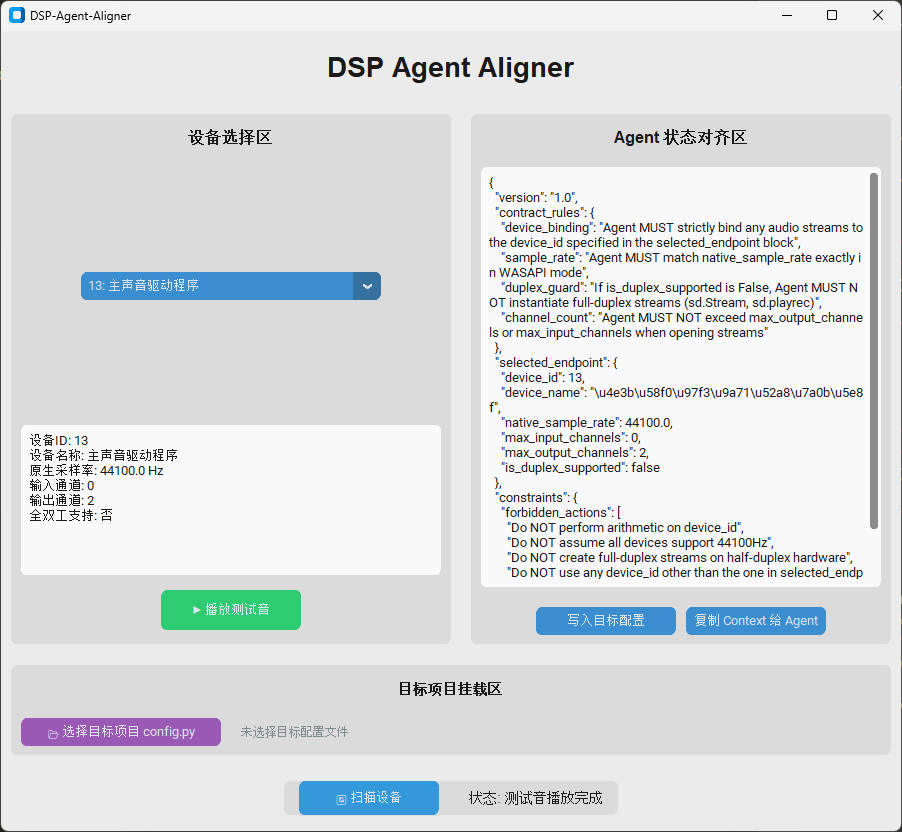

# 🎙️ DSP-Agent-Aligner (DAA)


**DSP-Agent-Aligner (DAA)** is a robust GUI infrastructure built for the AI-assisted audio programming era. It bridges the gap between your physical local audio hardware and LLM-based coding agents (like Cursor, Trae, or Claude).

Writing cross-platform audio code (like `pyo` or `sounddevice`) on Windows often leads to silent crashes, ghost WASAPI devices, and channel-mismatch errors. Worse, AI coding agents suffer from **"hardware hallucinations"**—blindly writing full-duplex audio code without knowing your local soundcard's actual topology.

**DAA solves this.** It provides a safe, non-blocking GUI to test your physical audio endpoints, safely hot-patches your project's configuration via AST, and instantly generates a deterministic `JSON Schema Context` to inject into your LLM prompt, ensuring **Zero-Hallucination** human-agent collaborative DSP programming.

---

## ✨ Key Features

- **🛡️ Safe Device Routing & Filtering**: Intelligently bypasses Windows WASAPI "0-channel ghost device" traps. Accurately calculates true `is_duplex_supported` flags to prevent PortAudio `[Errno -9998] Invalid number of channels` crashes.
- **🔊 Embodied Auditory Test Loop**: Features a thread-safe, non-blocking `sounddevice` test loop. Validates physical audio output without freezing the GUI or locking up the OS audio bus.
- **📝 AST Hot-Patching**: Safely injects the tested `TARGET_DEVICE_ID` and `SAMPLE_RATE` directly into your target project's `config.py` using Abstract Syntax Trees (AST). No regex breaking your code format, no OS file-locking deadlocks.
- **🤖 Zero-Hallucination Agent Contract**: Translates your physical hardware limits into a strict JSON Schema & Markdown prompt. Paste it to your LLM, and it will write perfectly aligned DSP code on the first try.
---

## 📸 Screenshots



---

## 🚀 Quick Start

### Prerequisites
- Python 3.11 or higher
- Windows OS (Optimized for Windows audio subsystem complexities)

### Installation

1. Clone the repository:
   ```bash
   git clone https://github.com/gunpowder78/DSP-Agent-Aligner.git
   cd DSP-Agent-Aligner
   ```

2. Create and activate a conda environment:
   ```bash
   conda create -n daa python=3.11
   conda activate daa
   ```

3. Install dependencies:
   ```bash
   pip install -r requirements.txt
   ```

4. Run the application:
   ```bash
   python dsp_aligner_app.py
   ```

---

## 📖 Usage Guide

### Step 1: Scan Audio Devices
Click **"🔄 扫描设备"** to discover all available audio endpoints on your system.

### Step 2: Select and Test
- Choose a device from the dropdown menu
- Click **"▶ 播放测试音"** to verify the device works correctly
- A 440Hz test tone will play through the selected endpoint

### Step 3: Mount Target Project
Click **"📂 选择目标项目 config.py"** to select your target project's configuration file.

### Step 4: Write Configuration
Click **"写入目标配置"** to inject the tested device ID and sample rate into your target project.

### Step 5: Copy Agent Context
Click **"复制 Context 给 Agent"** to copy the JSON Schema context to your clipboard, then paste it into your LLM prompt.

---

## 🏗️ Architecture

```
DSP-Agent-Aligner/
├── core/                      # Business logic layer
│   ├── audio_engine.py        # Device scanning & audio testing
│   ├── agent_context.py       # JSON Schema contract generator
│   └── config_patcher.py      # AST-based configuration patching
├── ui/                        # View layer (pure state reflector)
│   └── main_window.py         # CustomTkinter GUI
├── tests/                     # TDD test suite (44 tests)
├── requirements.txt
├── dsp_aligner_app.py         # MVC controller entry point
└── .traerules                 # Engineering constraints for AI agents
```

### Architecture Red Lines (Must Follow)
1. **`ui/` MUST NOT import `sounddevice`** - All hardware access stays in `core/`
2. **Cross-thread communication via `event_generate()`** - Thread-safe UI updates
3. **All tests use `tmp_path` isolation** - Never modify real files in tests
4. **Audio callbacks are non-blocking** - Use `sd.play()` + `sd.wait()` pattern

---

## 🧪 Testing

Run the full test suite:
```bash
pytest tests/ -v -p no:anyio
```

All 44 tests should pass.

---

## 📋 JSON Schema Contract Example

When you test a device, DAA generates a precise contract like this:

```json
{
  "version": "1.0",
  "contract_rules": {
    "device_binding": "Agent MUST strictly bind any audio streams to the device_id specified in the selected_endpoint block",
    "sample_rate": "Agent MUST match native_sample_rate exactly in WASAPI mode",
    "duplex_guard": "If is_duplex_supported is False, Agent MUST NOT instantiate full-duplex streams",
    "channel_count": "Agent MUST NOT exceed max_output_channels or max_input_channels"
  },
  "selected_endpoint": {
    "device_id": 11,
    "device_name": "Speakers (Realtek Audio)",
    "native_sample_rate": 48000.0,
    "max_input_channels": 0,
    "max_output_channels": 2,
    "is_duplex_supported": false
  },
  "constraints": {
    "forbidden_actions": [
      "Do NOT perform arithmetic on device_id",
      "Do NOT assume all devices support 44100Hz",
      "Do NOT create full-duplex streams on half-duplex hardware",
      "Do NOT use any device_id other than the one in selected_endpoint"
    ]
  }
}
```

---

## 📄 License

This project is licensed under the Apache License 2.0 - see the [LICENSE](LICENSE) file for details.

```
Copyright 2026 Agile Huang (艺术家黄小捷)

Licensed under the Apache License, Version 2.0 (the "License");
you may not use this file except in compliance with the License.
You may obtain a copy of the License at

    http://www.apache.org/licenses/LICENSE-2.0
```

---

## 🤝 Contributing

Contributions are welcome! Please read the engineering constraints in `.traerules` before submitting PRs.

---

## 🙏 Acknowledgments

- Built with [CustomTkinter](https://github.com/TomSchimansky/CustomTkinter)
- Audio powered by [sounddevice](https://python-sounddevice.readthedocs.io/)
- Inspired by the need for reliable human-agent collaboration in audio DSP development
